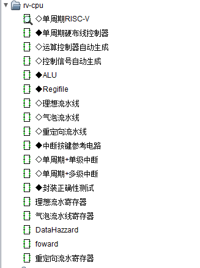
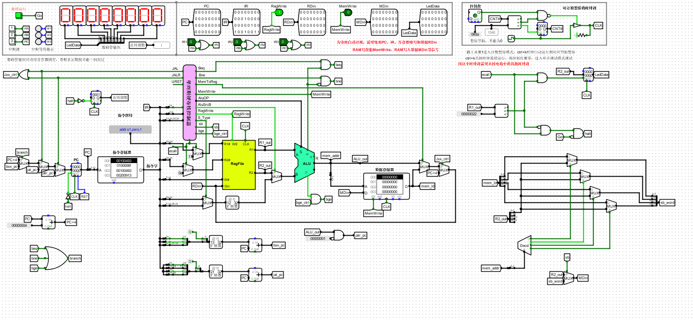
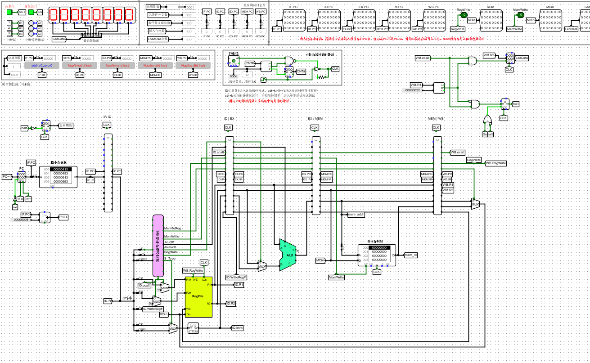
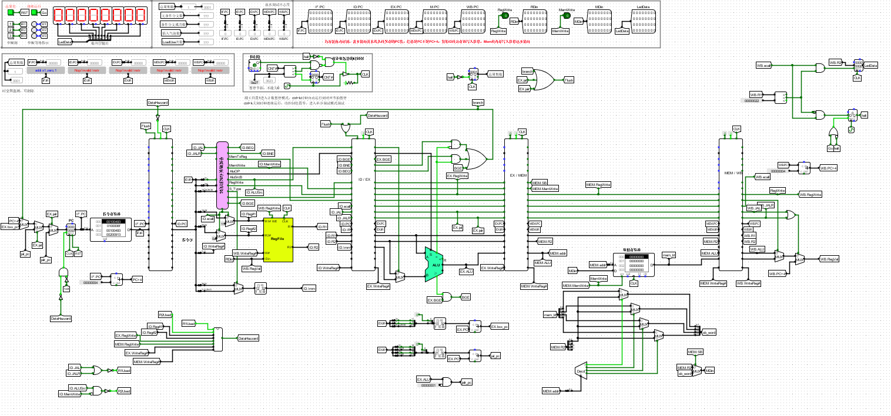
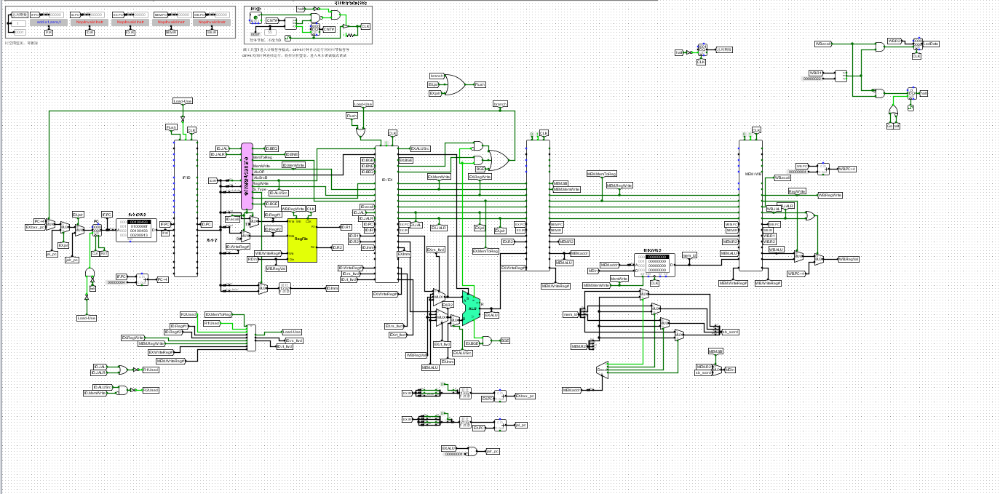
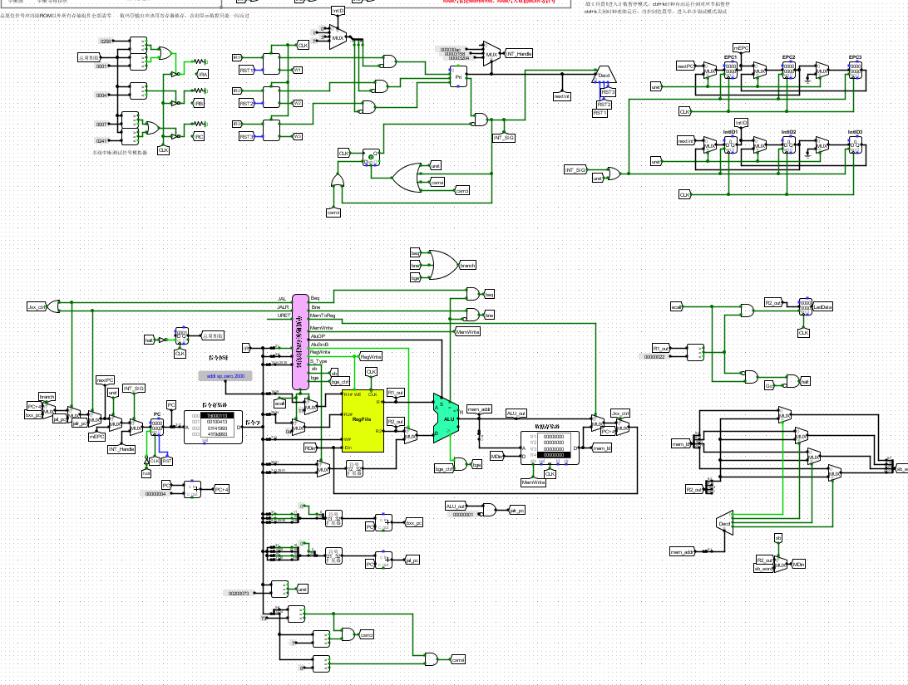

# rv-emu

将`rv-cpu.circ`导入至logism软件中进行电路仿真

## 信号生成

查阅risc-v指令集对应指令并将对应段填入`auto-gen.xlsx`中，会自动生成各个信号的表达式，填入信号控制器即可

## 单周期指令

支持基本指令，每条指令为一个周期

## 流水线

**理想流水线**

无分支指令，无数据冲突

**气泡流水线**

在出现分支结构与数据冲突时插入气泡暂停流水线

**重定向流水线**

数据冲突时不插入气泡，而是将流水线后段的数据重定向转发至前段，拥有比气泡流水线更好的性能

## 中断

具有优先级的多级嵌套中断

